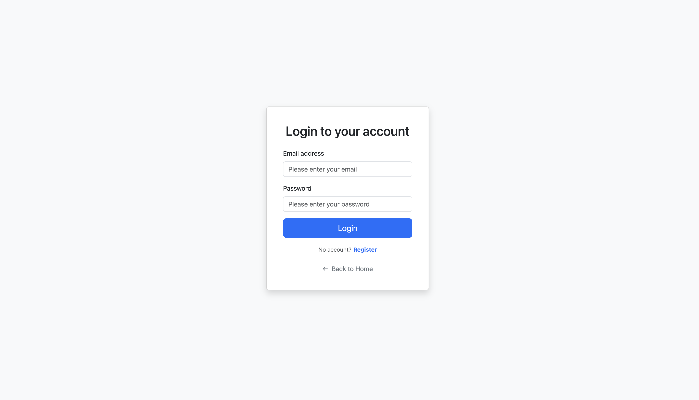
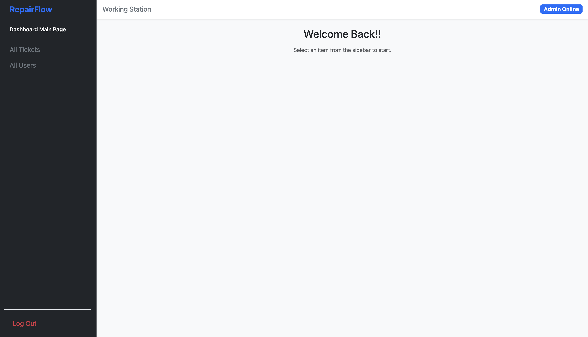
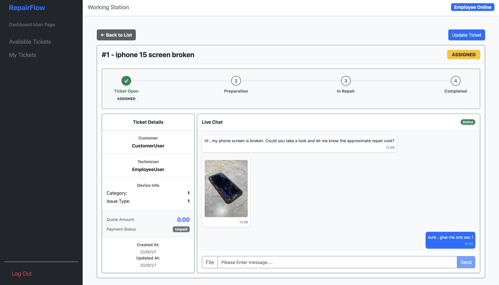
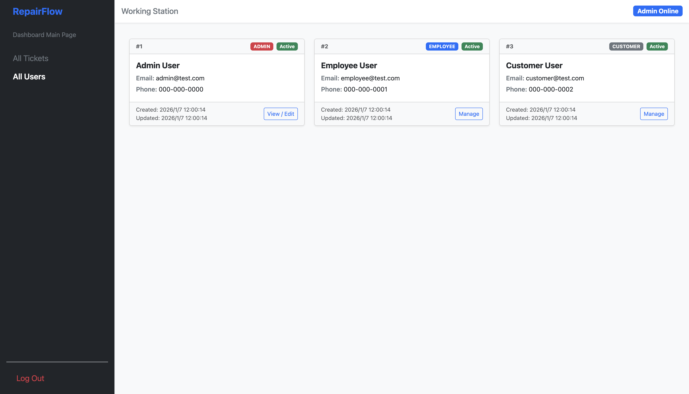

# RepairFlow — Full-Stack Repair Ticketing Platform

## Highlights
- Backend-focused full-stack application using Java (Spring Boot)
- Designed and implemented 15+ RESTful APIs (HTTP + JSON)
- Real-time chat system using WebSocket (STOMP)
- CI/CD pipeline with GitHub Actions (build, test, deploy)
- Dockerized deployment on AWS EC2 with Cloudflare integration
- Role-based access control with JWT authentication

A backend-focused full-stack repair platform designed with Java (Spring Boot) and React, featuring scalable REST APIs, real-time communication, and production-style deployment with CI/CD and cloud infrastructure.

## Demo (Docker-based)
Fully containerized application. Run the entire system locally using Docker Compose:

```
 docker compose -f docker-compose.prod.yml up -d
```
After startup:

Frontend: http://localhost:3000
Backend API: http://localhost:8080
PostgreSQL: localhost:5435

## Test Account Info 
```
|    Role     |      Test Account        |  Test password  | 
|   Admin     |     admin@test.com       |    11223344     |
|  Employee   |    employee@test.com     |    11223344     |
|  Customer   |    customer@test.com     |    11223344     |
```

## Architecture Overview
- Backend: Spring Boot (REST APIs, WebSocket, JWT Security)
- Frontend: React (role-based UI, API integration via Axios)
- Database: PostgreSQL (managed with Flyway migrations)
- Deployment: Dockerized services running on AWS EC2
- Networking: Cloudflare for DNS, SSL/TLS, and public access
- API Communication: REST (HTTP/JSON) + WebSocket (STOMP)

## CI/CD Pipeline
Implemented CI/CD pipelines using GitHub Actions:
- Automated build, test, and deployment workflows on each code push
- Ensured consistent and repeatable release processes
- Reduced manual deployment errors and improved system reliability

## Testing
- API testing using Postman to validate request/response behavior
- Verified authentication flows and role-based access control
- Tested ticket workflow transitions and real-time messaging features

## Screenshots
Auth form & JWT entry point



## Dashboard / Ticket List
Role-based navigation + ticket status


## Ticket Detail + Real-Time Chat
Ticket info + WebSocket chat + image upload


## Admin User Management
Role update panel


## Key Features
- RESTful APIs with Spring Boot
- JWT Authentication with Spring Security
- Role-Based Access Control (ADMIN / EMPLOYEE / CUSTOMER)
- Real-Time Chat using WebSocket (STOMP)
- Repair Ticket Workflow (State Machine)
- Image & File Uploads
- Flyway Database Migrations
- Dockerized Full-Stack Setup

## Ticket Status Workflow
PENDING → ASSIGNED → QUOTED → AWAITING_DEVICE → DEVICE_RECEIVED → IN_PROGRESS → READY_FOR_COMFIRMATION → PAID → SHIPPED → DELIVERED

### Customer-operable status
- QUOTED → AWAITING_DEVICE
- READY_FOR_COMFIRMATION → PAID
- SHIPPED → DELIVERED

### Employee-operable status
- PENDING → ASSIGNED
- ASSIGNED → QUOTED
- AWAITING_DEVICE → DEVICE_RECEIVED
- DEVICE_RECEIVED → IN_PROGRESS
- IN_PROGRESS → READY_FOR_COMFIRMATION
- PAID → SHIPPED

## Tech Stack

### Frontend
- React 18
- React Router
- Bootstrap / React-Bootstrap
- Axios

### Backend
- Spring Boot 3
- Spring Security + JWT
- Spring Data JPA
- WebSocket (STOMP)
- Flyway

### Database
- PostgreSQL 16

### DevOps
- Docker
- Docker Compose

## Future Improvements
- Payment integration (Stripe)
- Cloud file storage (AWS S3)

## Author
- Guang Yang
